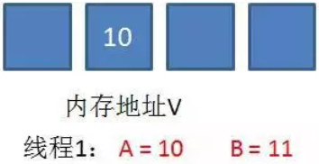
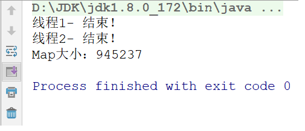

# 线程状态、volatile关键字、原子性、并发包、死锁、线程池

## 目标  

- [ ] 能够说出volatile关键字的作用

  * 实现成员变量多个线程修改后的可见性。

- [ ] 能够说明volatile关键字和synchronized关键字的区别

  * volatile修饰成员变量，实现变量的访问可见性，但是不能实现原子性。
  * synchronized可以修饰方法和代码块，加锁机制，可以实现线程安全。加锁以后变量自然可见。

- [ ] 能够理解原子类的工作机制

  * 基于CAS乐观锁。保证了安全性。

- [ ] 能够掌握原子类AtomicInteger的使用

  * ```
    private AtomicInteger atomicInteger = new AtomicInteger();
     int count = atomicInteger.incrementAndGet(); // 底层变量+1且返回！
    ```

- [ ] 能够描述ConcurrentHashMap类的作用

  * 安全性高，线程安全的，综合性能好。

- [ ] 能够描述CountDownLatch类的作用

- [ ] 能够描述CyclicBarrier类的作用

- [ ] 能够表述Semaphore类的作用

- [ ] 能够描述Exchanger类的作用

- [ ] 能够描述Java中线程池运行原理

- [ ] 能够描述死锁产生的原因


# 第一章 线程状态

## 1.1 线程状态概述

**线程由生到死的完整过程：**

当线程被创建并启动以后，它既不是一启动就进入了执行状态，也不是一直处于执行状态。在线程的生命周期中，有几种状态呢？在API中`java.lang.Thread.State`这个枚举中给出了六种线程状态：

这里先列出各个线程状态发生的条件，下面将会对每种状态进行详细解析

| 线程状态                | 导致状态发生条件                                             |
| ----------------------- | ------------------------------------------------------------ |
| NEW(新建)               | 线程刚被创建，但是并未启动。还没调用start方法。MyThread t = new MyThread只有线程对象，没有线程特征。 |
| Runnable(可运行)        | 线程可以在java虚拟机中运行的状态，可能正在运行自己代码，也可能没有，这取决于操作系统处理器。调用了t.start()方法   ：就绪（经典教法） |
| Blocked(锁阻塞)         | 当一个线程试图获取一个对象锁，而该对象锁被其他的线程持有，则该线程进入Blocked状态；当该线程持有锁时，该线程将变成Runnable状态。 |
| Waiting(无限等待)       | 一个线程在等待另一个线程执行一个（唤醒）动作时，该线程进入Waiting状态。进入这个状态后是不能自动唤醒的，必须等待另一个线程调用notify或者notifyAll方法才能够唤醒。 |
| Timed Waiting(计时等待) | 同waiting状态，有几个方法有超时参数，调用他们将进入Timed Waiting状态。这一状态将一直保持到超时期满或者接收到唤醒通知。带有超时参数的常用方法有Thread.sleep 、Object.wait。 |
| Teminated(被终止)       | 因为run方法正常退出而死亡，或者因为没有捕获的异常终止了run方法而死亡。 |


​	我们不需要去研究这几种状态的实现原理，我们只需知道在做线程操作中存在这样的状态。那我们怎么去理解这几个状态呢，新建与被终止还是很容易理解的，我们就研究一下线程从Runnable（可运行）状态与非运行状态之间的转换问题。

## 1.2 睡眠sleep方法

我们看到状态中有一个状态叫做计时等待，可以通过Thread类的方法来进行演示.

`public static void  sleep(long time)`  让当前线程进入到睡眠状态，到毫秒后自动醒来继续执行

```java
public class Test{
  public static void main(String[] args){
    for(int i = 1;i<=5;i++){
      	Thread.sleep(1000);
        System.out.println(i)   
    } 
  }
}
```

这时我们发现主线程执行到sleep方法会休眠1秒后再继续执行。

## 1.3 等待和唤醒

Object类的方法

`public void wait()` : 让当前线程进入到等待状态 此方法必须锁对象调用.

```java
public class Demo1_wait {
    public static void main(String[] args) throws InterruptedException {
	   // 步骤1 : 子线程开启,进入无限等待状态, 没有被唤醒,无法继续运行.
        new Thread(() -> {
            try {

                System.out.println("begin wait ....");
                synchronized ("") {
                    "".wait();
                }
                System.out.println("over");
            } catch (Exception e) {
            }
        }).start();
    }
```

`public void notify()` : 唤醒当前锁对象上等待状态的线程  此方法必须锁对象调用.

```java
public class Demo2_notify {
    public static void main(String[] args) throws InterruptedException {
	   // 步骤1 : 子线程开启,进入无限等待状态, 没有被唤醒,无法继续运行.
        new Thread(() -> {
            try {

                System.out.println("begin wait ....");
                synchronized ("") {
                    "".wait();
                }
                System.out.println("over");
            } catch (Exception e) {
            }
        }).start();

        //步骤2:  加入如下代码后, 3秒后,会执行notify方法, 唤醒wait中线程.
        Thread.sleep(3000);
        new Thread(() -> {
            try {
                synchronized ("") {
                    System.out.println("唤醒");
                    "".notify();
                }
            } catch (Exception e) {
            }
        }).start();
    }
}


/*

begin wait ....
唤醒
over

*/
```

## 1.4 等待唤醒案例（包子铺卖包子）

```java
定义一个集合，包子铺线程完成生产包子，包子添加到集合中；吃货线程完成购买包子，包子从集合中移除。
1. 当包子没有时（包子状态为false），吃货线程等待.
2. 包子铺线程生产包子（即包子状态为true），并通知吃货线程（解除吃货的等待状态）
```

**代码示例：**

生成包子类：

```java
public class BaoZiPu extends Thread{
    private List<String> list ;
    public BaoZiPu(String name,ArrayList<String> list){
        super(name);
        this.list = list;
    }
    @Override
    public void run() {
        	int i = 0; 
            while(true){
                    //list作为锁对象
                    synchronized (list){
                        if(list.size()>0){
                            //存元素的线程进入到等待状态
                            try {
                                list.wait();
                            } catch (InterruptedException e) {
                                e.printStackTrace();
                            }
                        }
                        //如果线程没进入到等待状态 说明集合中没有元素
                        //向集合中添加元素
                        list.add("包子"+i++);
                        System.out.println(list);
                        //集合中已经有元素了 唤醒获取元素的线程
                        list.notify();
                    }
                }
            }
    }
}
```

消费包子类：

```java
public class ChiHuo extends Thread {

    private List<String> list ;
    public ChiHuo(String name,ArrayList<String> list){
        super(name);
        this.list = list;
    }

    @Override
    public void run() {
 			//为了能看到效果 写个死循环
                while(true){
                    //由于使用的同一个集合 list作为锁对象
                    synchronized (list){
                        //如果集合中没有元素 获取元素的线程进入到等待状态
                        if(list.size()==0){
                            try {
                                list.wait();
                            } catch (InterruptedException e) {
                                e.printStackTrace();
                            }
                        }
                        //如果集合中有元素 则获取元素的线程获取元素(删除)
                        list.remove(0);
                        //打印集合 集合中没有元素了
                        System.out.println(list);
                        //集合中已经没有元素 则唤醒添加元素的线程 向集合中添加元素
                        list.notify();
                    }
                }
            }
    }
}
```

测试类：

```java
public class Demo {
    public static void main(String[] args) {
        //等待唤醒案例
        List<String> list = new ArrayList<>();
        // 创建线程对象        
         BaoZiPu bzp = new BaoZiPu("包子铺",list);
        ChiHuo ch = new ChiHuo("吃货",list);
        // 开启线程
        bzp.start();
        ch.start();
    }
}
```

# 第二章 volatile关键字

## 2.1. 看程序说结果

```java
public class VolatileThread extends Thread {

    // 定义成员变量
    private boolean flag = false ;
    public boolean isFlag() { return flag;}

    @Override
    public void run() {

        try {
            Thread.sleep(1000);
        } catch (InterruptedException e) {
            e.printStackTrace();
        }

        // 将flag的值更改为true
        this.flag = true ;
        System.out.println("flag=" + flag);

    }
}

public class VolatileThreadDemo {// 测试类
    
    public static void main(String[] args) {

        // 创建VolatileThread线程对象
        VolatileThread volatileThread = new VolatileThread() ;
        volatileThread.start();

        // main方法
        while(true) {
            if(volatileThread.isFlag()) {
                System.out.println("执行了======");
            }
        }
    }
}
```

结果：


我们看到，VolatileThread线程中已经将flag设置为true，但main()方法中始终没有读到，从而没有打印。

## 2.2. JMM

概述：JMM(Java Memory Model)Java内存模型,是java虚拟机规范中所定义的一种内存模型。

Java内存模型(Java Memory Model)描述了Java程序中各种变量(线程共享变量)的访问规则，以及在JVM中将变量存储到内存和从内存中读取变量这样的底层细节。

==所有的共享变量都存储于主内存。这里所说的变量指的是实例变量和类变量。不包含局部变量，因为局部变量是线程私有的，因此不存在竞争问题==。每一个线程还存在自己的工作内存，线程的工作内存，保留了被线程使用的变量的工作副本。线程对变量的所有的操作(读，取)都必须在工作内存中完成，而不能直接读写主内存中的变量，不同线程之间也不能直接访问对方工作内存中的变量，线程间变量的值的传递需要通过主内存完成。


## 2.3. 问题分析


1. VolatileThread线程从主内存读取到数据放入其对应的工作内存

2. 将flag的值更改为true，但是这个时候flag的值还没有写会主内存

3. 此时main方法读取到了flag的值为false

4. 当VolatileThread线程将flag的值写回去后，但是main函数里面的while(true)调用的是系统比较底层的代码，速度快，快到没有时间再去读取主存中的值，

   所以while(true)读取到的值一直是false。(如果有一个时刻main线程从主内存中读取到了主内存中flag的最新值，那么if语句就可以执行，main线程何时从主内存中读取最新的值，我们无法控制)

## 2.4. 问题处理

### 加锁

```java
   // main方法
   while(true) {
       synchronized (volatileThread) {
           if(volatileThread.isFlag()) {
               System.out.println("执行了======");
           }
       }
   }
```

   某一个线程进入synchronized代码块前后，执行过程入如下：

   a.线程获得锁

   b.清空工作内存

   c.从主内存拷贝共享变量最新的值到工作内存成为副本

   d.执行代码

   e.将修改后的副本的值刷新回主内存中

   f.线程释放锁

### volatile关键字

   使用volatile关键字：

```java
   private volatile boolean flag ;
```

   工作原理：

  

1. VolatileThread线程从主内存读取到数据放入其对应的工作内存
2. 将flag的值更改为true，但是这个时候flag的值还没有写会主内存
3. 此时main方法main方法读取到了flag的值为false
4. 当VolatileThread线程将flag的值写回去后，失效其他线程对此变量副本
5. 再次对flag进行操作的时候线程会从主内存读取最新的值，放入到工作内存中

   总结： ==volatile保证不同线程对共享变量操作的可见性，也就是说一个线程修改了volatile修饰的变量，当修改写回主内存时，另外一个线程立即看到最新的值==。

```
     但是volatile不保证原子性。
```

### volatile与synchronized

- volatile只能修饰实例变量和类变量，而synchronized可以修饰方法，以及代码块。

- ==volatile保证数据的可见性，但是不保证原子性(多线程进行写操作，不保证线程安全);而synchronized是一种排他（互斥）的机制==


# 第三章 原子性

概述：==所谓的原子性是指在一次操作或者多次操作中，要么所有的操作全部都得到了执行并且不会受到任何因素的干扰而中断，要么所有的操作都不执行。== 

## 3.1. 看程序说结果

```java
public class VolatileAtomicThread implements Runnable {

    // 定义一个int类型的遍历
    private int count = 0 ;

    @Override
    public void run() {
        // 对该变量进行++操作，100次
        for(int x = 0 ; x < 100 ; x++) {
            count++ ;					
            System.out.println("count =========>>>> " + count);
        }
    }

}

public class VolatileAtomicThreadDemo {

    public static void main(String[] args) {

        // 创建VolatileAtomicThread对象
        VolatileAtomicThread volatileAtomicThread = new VolatileAtomicThread() ;

        // 开启100个线程对count进行++操作
        for(int x = 0 ; x < 100 ; x++) {
            new Thread(volatileAtomicThread).start();
        }
        
    }

}
```

执行结果：不保证一定是10000


## 3.2. 问题原理说明

以上问题主要是发生在count++操作上：

count++操作包含3个步骤：

- 从主内存中读取数据到工作内存
- 对工作内存中的数据进行++操作
- 将工作内存中的数据写回到主内存

count++操作不是一个原子性操作，也就是说在某一个时刻对某一个操作的执行，有可能被其他的线程打断。


1）假设此时x的值是100，线程A需要对改变量进行自增1的操作，首先它需要从主内存中读取变量x的值。由于CPU的切换关系，此时CPU的执行权被切换到了B线程。A线程就处于就绪状态，B线程处于运行状态

2）线程B也需要从主内存中读取x变量的值,由于线程A没有对x值做任何修改因此此时B读取到的数据还是100

3）线程B工作内存中x执行了+1操作，但是未刷新之主内存中

4）此时CPU的执行权切换到了A线程上，由于此时线程B没有将工作内存中的数据刷新到主内存，因此A线程工作内存中的变量值还是100，没有失效。A线程对工作内存中的数据进行了+1操作

5）线程B将101写入到主内存

6）线程A将101写入到主内存

虽然计算了2次，但是只对A进行了1次修改。

## 3.3. volatile原子性测试

### 代码测试

```java
// 定义一个int类型的变量
private volatile int count = 0 ;
```

小结：在多线程环境下，volatile关键字可以保证共享数据的可见性，但是并不能保证对数据操作的原子性（在多线程环境下volatile修饰的变量也是线程不安全的）。

在多线程环境下，要保证数据的安全性，我们还需要使用锁机制。

### volatile的使用场景

- 开关控制

  ==利用可见性特点，控制某一段代码执行或者关闭==(比如今天课程的第一个案例)。

- 多个线程操作共享变量，但是是有一个线程对其进行写操作，其他的线程都是读

## 3.4. 问题解决

### 使用锁机制

我们可以给count++操作添加锁，那么count++操作就是临界区的代码，临界区只能有一个线程去执行，所以count++就变成了原子操作。

```java
public class VolatileAtomicThread implements Runnable {

    // 定义一个int类型的变量
    private volatile int count = 0 ;
    private static final Object obj = new Object();

    @Override
    public void run() {

        // 对该变量进行++操作，100次
        for(int x = 0 ; x < 100 ; x++) {
            synchronized (obj) {
                count++ ;
                System.out.println("count =========>>>> " + count);
            }
        }

    }

}
```

### 原子类

概述：java从JDK1.5开始提供了java.util.concurrent.atomic包(简称Atomic包)，这个包中的原子操作类提供了一种用法简单，性能高效，线程安全地更新一个变量的方式。

#### AtomicInteger

原子型Integer，可以实现原子更新操作

```java
public AtomicInteger()：	   				初始化一个默认值为0的原子型Integer
public AtomicInteger(int initialValue)： 初始化一个指定值的原子型Integer

int get():   			 				 获取值
int getAndIncrement():      			 
以原子方式将当前值加1，注意，这里返回的是自增前的值。
int incrementAndGet():     				 
以原子方式将当前值加1，注意，这里返回的是自增后的值。
int addAndGet(int data):				 
以原子方式将输入的数值与实例中的值（AtomicInteger里的value）相加，并返回结果。
int getAndSet(int value):   			 
以原子方式设置为newValue的值，并返回旧值。
```

演示基本使用。

#### 案例改造

使用AtomicInteger对案例进行改造.

```java
public class VolatileAtomicThread implements Runnable {

    // 定义一个int类型的变量
    private AtomicInteger atomicInteger = new AtomicInteger() ;

    @Override
    public void run() {

        // 对该变量进行++操作，100次
        for(int x = 0 ; x < 100 ; x++) {
            int i = atomicInteger.getAndIncrement();
            System.out.println("count =========>>>> " + i);
        }

    }

}
```

### 原子类CAS机制实现线程安全。

#### 概述


==CAS的全成是： Compare And Swap(比较再交换); 是现代CPU广泛支持的一种对内存中的共享数据进行操作的一种特殊指令==。

CAS可以将read-modify-check-write转换为原子操作，这个原子操作直接由处理器保证。

CAS机制当中使用了3个基本操作数：内存地址V，旧的预期值A，要修改的新值B。

举例：

1. 在内存地址V当中，存储着值为10的变量。


2. 此时线程1想要把变量的值增加1。对线程1来说，旧的预期值A=10，要修改的新值B=11。



3. 在线程1要提交更新之前，另一个线程2抢先一步，把内存地址V中的变量值率先更新成了11。

 

4. 线程1开始提交更新，首先进行A和地址V的实际值比较（Compare），发现A不等于V的实际值，提交失败。


5. 线程1重新获取内存地址V的当前值，并重新计算想要修改的新值。此时对线程1来说，A=11，B=12。这个重新尝试的过程被称为自旋。


6. 这一次比较幸运，没有其他线程改变地址V的值。线程1进行Compare，发现A和地址V的实际值是相等的。


7. 线程1进行SWAP，把地址V的值替换为B，也就是12。


#### CAS与Synchronized：乐观锁，悲观锁。

CAS和Synchronized都可以保证多线程环境下共享数据的安全性。那么他们两者有什么区别？

==Synchronized是从悲观的角度出发（悲观锁）==

总是假设最坏的情况，每次去拿数据的时候都认为别人会修改，所以每次在拿数据的时候都会上锁，这样别人想拿这个数据就会阻塞直到它拿到锁

（**共享资源每次只给一个线程使用，其它线程阻塞，用完后再把资源转让给其它线程**）。因此Synchronized我们也将其称之为**悲观锁**。jdk中的ReentrantLock也是一种悲观锁。性能较差！！

==CAS是从乐观的角度出发:==

总是假设最好的情况，每次去拿数据的时候都认为别人不会修改，所以不会上锁，但是在更新的时候会判断一下在此期间别人有没有去更新这个数据。

CAS这种机制我们也可以将其称之为乐观锁。综合性能较好！


# 第四章 并发包 

在JDK的并发包里提供了几个非常有用的并发容器和并发工具类。供我们在多线程开发中进行使用。

## 4.1  ConcurrentHashMap

为什么要使用ConcurrentHashMap：

1. HashMap线程不安全，会导致数据错乱
2. 使用线程安全的Hashtable效率低下

基于以上两个原因，便有了ConcurrentHashMap的登场机会。

- **HashMap线程不安全演示。**

公有、静态的集合：

~~~java
public class Const {
	public static HashMap<String,String> map = new HashMap<>();
}
~~~
线程，向map中写入数据：

~~~java
public void run() {
		for (int i = 0; i < 500000; i++) {
			Const.map.put(this.getName() + (i + 1), this.getName() + i + 1);
		}
    	System.out.println(this.getName() + " 结束！");
	}
~~~
测试类：

~~~java
public class Demo {
	public static void main(String[] args) throws InterruptedException {
		Thread1A a1 = new Thread1A();
		Thread1A a2 = new Thread1A();
		a1.setName("线程1-");
		a2.setName("线程2-");

		a1.start();
		a2.start();
		//休息10秒，确保两个线程执行完毕
		Thread.sleep(1000 * 5);
		//打印集合大小
		System.out.println("Map大小：" + Const.map.size());
	}
}
~~~
说明：两个线程分别向同一个map中写入50000个键值对，最后map的size应为：100000，但多运行几次会发现有以下几种错误：

1. 假死：

   

2. 异常：

   

3. 错误结果：

   


- **为了保证线程安全，可以使用Hashtable。注意：线程中加入了计时**

  公有、静态的集合：

  ```java
  public class Const {
  	public static Hashtable<String,String> map = new Hashtable<>();
  }
  ```

  线程，向map中写入数据：

  ```java
  public void run() {
  		long start = System.currentTimeMillis();
  		for (int i = 0; i < 500000; i++) {
  			Const.map.put(this.getName() + (i + 1), this.getName() + i + 1);
  		}
  		long end = System.currentTimeMillis();
  		System.out.println(this.getName() + " 结束！用时：" + (end - start) + " 毫秒");
  	}
  ```

  测试类：

  ```java
  public class Demo {
  	public static void main(String[] args) throws InterruptedException {
  		Thread1A a1 = new Thread1A();
  		Thread1A a2 = new Thread1A();
  		a1.setName("线程1-");
  		a2.setName("线程2-");
  
  		a1.start();
  		a2.start();
  		//休息10秒，确保两个线程执行完毕
  		Thread.sleep(1000 * 5);
  		//打印集合大小
  		System.out.println("Map大小：" + Const.map.size());
  	}
  }
  ```

  执行结果：

  

可以看到，Hashtable保证的线程安全，时间是2秒多。

- **再看ConcurrentHashMap**

  公有、静态的集合：

  ```java
  public class Const {
  	public static ConcurrentHashMap<String,String> map = new ConcurrentHashMap<>();
  }
  ```

  线程，向map中写入数据：

  ```java
  public void run() {
  		long start = System.currentTimeMillis();
  		for (int i = 0; i < 500000; i++) {
  			Const.map.put(this.getName() + (i + 1), this.getName() + i + 1);
  		}
  		long end = System.currentTimeMillis();
  		System.out.println(this.getName() + " 结束！用时：" + (end - start) + " 毫秒");
  	}
  ```

  测试类：

  ```java
  public class Demo {
  	public static void main(String[] args) throws InterruptedException {
  		Thread1A a1 = new Thread1A();
  		Thread1A a2 = new Thread1A();
  		a1.setName("线程1-");
  		a2.setName("线程2-");
  
  		a1.start();
  		a2.start();
  		//休息10秒，确保两个线程执行完毕
  		Thread.sleep(1000 * 5);
  		//打印集合大小
  		System.out.println("Map大小：" + Const.map.size());
  	}
  }
  ```

  执行结果：

  

  ConcurrentHashMap仍能保证结果正确，而且提高了效率。

HashTable效率低下原因：

```java
public synchronized V put(K key, V value) 
public synchronized V get(Object key)
```

==HashTable容器使用synchronized来保证线程安全，但在线程竞争激烈的情况下HashTable的效率非常低下==。因为当一个线程访问HashTable的同步方法，其他线程也访问HashTable的同步方法时，会进入阻塞状态。如线程1使用put进行元素添加，线程2不但不能使用put方法添加元素，也不能使用get方法来获取元素，所以竞争越激烈效率越低。


==**ConcurrentHashMap高效的原因：CAS + 局部(synchronized)锁定**分段式锁==


## 4.2 CountDownLatch

CountDownLatch允许一个或多个线程等待其他线程完成操作，再执行自己。

例如：线程1要执行打印：A和C，线程2要执行打印：B，但线程1在打印A后，要线程2打印B之后才能打印C，所以：线程1在打印A后，必须等待线程2打印完B之后才能继续执行。

CountDownLatch构造方法:

```java
public CountDownLatch(int count)// 初始化一个指定计数器的CountDownLatch对象
```

CountDownLatch重要方法:

```java
public void await() throws InterruptedException// 让当前线程等待
public void countDown()	// 计数器进行减1
```

- **示例**
1). 制作线程1：
~~~java
public class ThreadA extends Thread {
    private CountDownLatch down ;
    public ThreadA(CountDownLatch down) {
        this.down = down;
    }
    @Override
    public void run() {
        System.out.println("A");
        try {
            down.await();
        } catch (InterruptedException e) {
            e.printStackTrace();
        }
        System.out.println("C");
    }
}
~~~
2). 制作线程2：
~~~java
public class ThreadB extends Thread {
    private CountDownLatch down ;
    public ThreadB(CountDownLatch down) {
        this.down = down;
    }
    @Override
    public void run() {
        System.out.println("B");
        down.countDown();
    }
}
~~~
3).制作测试类：
~~~java
public class Demo {
    public static void main(String[] args) {
        CountDownLatch down = new CountDownLatch(1);//创建1个计数器
        new ThreadA(down).start();
        new ThreadB(down).start();
    }
}
~~~
4). 执行结果：
会保证按：A B C的顺序打印。

说明：

CountDownLatch中count down是倒数的意思，latch则是门闩的含义。整体含义可以理解为倒数的门栓，似乎有一点“三二一，芝麻开门”的感觉。

CountDownLatch是通过一个计数器来实现的，每当一个线程完成了自己的任务后，可以调用countDown()方法让计数器-1，当计数器到达0时，调用CountDownLatch。

await()方法的线程阻塞状态解除，继续执行。

## 4.3 CyclicBarrier

### 概述

CyclicBarrier的字面意思是可循环使用（Cyclic）的屏障（Barrier）。它要做的事情是，让一组线程到达一个屏障（也可以叫同步点）时被阻塞，直到最后一个线程到达屏障时，屏障才会开门，所有被屏障拦截的线程才会继续运行。

例如：公司召集5名员工开会，等5名员工都到了，会议开始。

 我们创建5个员工线程，1个开会线程，几乎同时启动，使用CyclicBarrier保证5名员工线程全部执行后，再执行开会线程。

CyclicBarrier构造方法：

```java
public CyclicBarrier(int parties, Runnable barrierAction)// 用于在线程到达屏障时，优先执行barrierAction，方便处理更复杂的业务场景
```

CyclicBarrier重要方法：

```java
public int await()// 每个线程调用await方法告诉CyclicBarrier我已经到达了屏障，然后当前线程被阻塞
```

- **示例代码：**
1). 制作员工线程：
~~~java
public class PersonThread extends Thread {
	private CyclicBarrier cbRef;
	public PersonThread(CyclicBarrier cbRef) {
		this.cbRef = cbRef;
	}
	@Override
	public void run() {
		try {
			Thread.sleep((int) (Math.random() * 1000));
			System.out.println(Thread.currentThread().getName() + " 到了! ");
			cbRef.await();
		} catch (InterruptedException e) {
			e.printStackTrace();
		} catch (BrokenBarrierException e) {
			e.printStackTrace();
		}
	}
}
~~~
2). 制作开会线程：
~~~java
public class MeetingThread extends Thread {
    @Override
    public void run() {
        System.out.println("好了，人都到了，开始开会......");
    }
}
~~~
3). 制作测试类：
~~~java
public class Demo {
	public static void main(String[] args) {
		CyclicBarrier cbRef = new CyclicBarrier(5, new MeetingThread());//等待5个线程执行完毕，再执行MeetingThread
		PersonThread p1 = new PersonThread(cbRef);
		PersonThread p2 = new PersonThread(cbRef);
		PersonThread p3 = new PersonThread(cbRef);
		PersonThread p4 = new PersonThread(cbRef);
		PersonThread p5 = new PersonThread(cbRef);
		p1.start();
		p2.start();
		p3.start();
		p4.start();
		p5.start();
	}
}
~~~
4). 执行结果：


### 使用场景

使用场景：CyclicBarrier可以用于多线程计算数据，最后合并计算结果的场景。

需求：使用两个线程读取2个文件中的数据，当两个文件中的数据都读取完毕以后，进行数据的汇总操作。


## 4.4 Semaphore

Semaphore（发信号）的主要作用是控制线程的并发数量。

synchronized可以起到"锁"的作用，但某个时间段内，只能有一个线程允许执行。

Semaphore可以设置同时允许几个线程执行。

Semaphore字面意思是信号量的意思，它的作用是控制访问特定资源的线程数目。

Semaphore构造方法：

```java
public Semaphore(int permits)						permits 表示许可线程的数量
public Semaphore(int permits, boolean fair)			fair 表示公平性，如果这个设为 true 的话，下次执行的线程会是等待最久的线程
```

Semaphore重要方法：

```java
public void acquire() throws InterruptedException	表示获取许可
public void release()								release() 表示释放许可
```

- **示例一：同时允许1个线程执行**

1). 制作一个Service类：
~~~java
public class Service {
    private Semaphore semaphore = new Semaphore(1);//1表示许可的意思，表示最多允许1个线程执行acquire()和release()之间的内容
    public void testMethod() {
        try {
            semaphore.acquire();
            System.out.println(Thread.currentThread().getName()
                    + " 进入 时间=" + System.currentTimeMillis());
            Thread.sleep(1000);
            System.out.println(Thread.currentThread().getName()
                    + "   结束 时间=" + System.currentTimeMillis());
            semaphore.release();
			//acquire()和release()方法之间的代码为"同步代码"
        } catch (InterruptedException e) {
            e.printStackTrace();
        }
    }
}
~~~
2). 制作线程类：

~~~java
public class ThreadA extends Thread {
	private Service service;
	public ThreadA(Service service) {
		super();
		this.service = service;
	}
	@Override
	public void run() {
		service.testMethod();
	}
}
~~~


3). 测试类：

~~~java
public class Demo {
	public static void main(String[] args) {
		Service service = new Service();
        //启动5个线程
		for (int i = 1; i <= 5; i++) {
			ThreadA a = new ThreadA(service);
			a.setName("线程 " + i);
			a.start();//5个线程会同时执行Service的testMethod方法，而某个时间段只能有1个线程执行
		}
	}
}
~~~

4). 结果：


- **示例二：同时允许2个线程同时执行**
1). 修改Service类，将new Semaphore(1)改为2即可：
~~~java
public class Service {
    private Semaphore semaphore = new Semaphore(2);//2表示许可的意思，表示最多允许2个线程执行acquire()和release()之间的内容
    public void testMethod() {
        try {
            semaphore.acquire();
            System.out.println(Thread.currentThread().getName()
                    + " 进入 时间=" + System.currentTimeMillis());
            Thread.sleep(5000);
            System.out.println(Thread.currentThread().getName()
                    + "   结束 时间=" + System.currentTimeMillis());
            semaphore.release();
			//acquire()和release()方法之间的代码为"同步代码"
        } catch (InterruptedException e) {
            e.printStackTrace();
        }
    }
}
~~~
2). 再次执行结果：


## 4.5 Exchanger

### 概述

Exchanger（交换者）是一个用于线程间协作的工具类。Exchanger用于进行线程间的数据交换。

这两个线程通过exchange方法交换数据，如果第一个线程先执行exchange()方法，它会一直等待第二个线程也执行exchange方法，当两个线程都到达同步点时，这两个线程就可以交换数据，将本线程生产出来的数据传递给对方。

Exchanger构造方法：

```java
public Exchanger()
```

Exchanger重要方法：

```java
public V exchange(V x)
```

- **示例一：exchange方法的阻塞特性**

1).制作线程A，并能够接收一个Exchanger对象：
~~~java
public class ThreadA extends Thread {
	private Exchanger<String> exchanger;
	public ThreadA(Exchanger<String> exchanger) {
		super();
		this.exchanger = exchanger;
	}
	@Override
	public void run() {
		try {
			System.out.println("线程A欲传递值'礼物A'给线程B，并等待线程B的值...");
			System.out.println("在线程A中得到线程B的值=" + exchanger.exchange("礼物A"));

		} catch (InterruptedException e) {
			e.printStackTrace();
		}
	}

}
~~~

2). 制作main()方法：

~~~java
public class Demo {
	public static void main(String[] args) {
		Exchanger<String> exchanger = new Exchanger<String>();
		ThreadA a = new ThreadA(exchanger);
		a.start();
	}
}
~~~

3).执行结果：


- **示例二：exchange方法执行交换**

1).制作线程A：
~~~java
public class ThreadA extends Thread {
	private Exchanger<String> exchanger;
	public ThreadA(Exchanger<String> exchanger) {
		super();
		this.exchanger = exchanger;
	}
	@Override
	public void run() {
		try {
			System.out.println("线程A欲传递值'礼物A'给线程B，并等待线程B的值...");
			System.out.println("在线程A中得到线程B的值=" + exchanger.exchange("礼物A"));
		} catch (InterruptedException e) {
			e.printStackTrace();
		}
	}
}
~~~
2).制作线程B：
~~~java
public class ThreadB extends Thread {
	private Exchanger<String> exchanger;
	public ThreadB(Exchanger<String> exchanger) {
		super();
		this.exchanger = exchanger;
	}
	@Override
	public void run() {
		try {
			System.out.println("线程B欲传递值'礼物B'给线程A，并等待线程A的值...");
			System.out.println("在线程B中得到线程A的值=" + exchanger.exchange("礼物B"));

		} catch (InterruptedException e) {
			e.printStackTrace();
		}
	}
}
~~~
3).制作测试类：
~~~java
public class Demo {
	public static void main(String[] args) throws InterruptedException {
		Exchanger<String> exchanger = new Exchanger<String>();
		ThreadA a = new ThreadA(exchanger);
		ThreadB b = new ThreadB(exchanger);
		a.start();
		b.start();
	}
}
~~~
4).执行结果：


- **示例三：exchange方法的超时**

1).制作线程A：
~~~java
public class ThreadA extends Thread {
	private Exchanger<String> exchanger;
	public ThreadA(Exchanger<String> exchanger) {
		super();
		this.exchanger = exchanger;
	}
	@Override
	public void run() {
		try {
			System.out.println("线程A欲传递值'礼物A'给线程B，并等待线程B的值，只等5秒...");
			System.out.println("在线程A中得到线程B的值 =" + exchanger.exchange("礼物A",5, TimeUnit.SECONDS));
			System.out.println("线程A结束！");
		} catch (InterruptedException e) {
			e.printStackTrace();
		} catch (TimeoutException e) {
			System.out.println("5秒钟没等到线程B的值，线程A结束！");
		}
	}
}
~~~
2).制作测试类：
~~~java
public class Run {
	public static void main(String[] args) {
		Exchanger<String> exchanger = new Exchanger<String>();
		ThreadA a = new ThreadA(exchanger);
		a.start();
	}
}
~~~
3).测试结果：


### 使用场景

使用场景：可以做数据校对工作

需求：比如我们需要将纸制银行流水通过人工的方式录入成电子银行流水。为了避免错误，采用AB岗两人进行录入，录入到两个文件中，系统需要加载这两个文件，

并对两个文件数据进行校对，看看是否录入一致，

# 第五章 线程池方式

## 5.1 线程池的思想 


我们使用线程的时候就去创建一个线程，这样实现起来非常简便，但是就会有一个问题：

如果并发的线程数量很多，并且每个线程都是执行一个时间很短的任务就结束了，这样频繁创建线程就会大大降低系统的效率，因为频繁创建线程和销毁线程需要时间，线程也属于宝贵的系统资源。

那么有没有一种办法使得线程可以复用，就是执行完一个任务，并不被销毁，而是可以继续执行其他的任务？

在Java中可以通过线程池来达到这样的效果。今天我们就来详细讲解一下Java的线程池。

## 5.2 07线程池概念

- **线程池：**其实就是一个容纳多个线程的容器，其中的线程可以反复使用，省去了频繁创建线程对象的操作，无需反复创建线程而消耗过多资源。

由于线程池中有很多操作都是与优化资源相关的，我们在这里就不多赘述。我们通过一张图来了解线程池的工作原理：


合理利用线程池能够带来三个好处：

1. ==降低资源消耗==。减少了创建和销毁线程的次数，每个工作线程都可以被重复利用，可执行多个任务。
2. ==提高响应速度==。当任务到达时，任务可以不需要的等到线程创建就能立即执行。
3. ==提高线程的可管理性==。可以根据系统的承受能力，调整线程池中工作线线程的数目，防止因为消耗过多的内存，而把服务器累趴下(每个线程需要大约1MB内存，线程开的越多，消耗的内存也就越大，最后死机)。

## 5.3 线程池的使用

Java里面线程池的顶级接口是`java.util.concurrent.Executor`，但是严格意义上讲`Executor`并不是一个线程池，而只是一个执行线程的工具。真正的线程池接口是`java.util.concurrent.ExecutorService`。

要配置一个线程池是比较复杂的，尤其是对于线程池的原理不是很清楚的情况下，很有可能配置的线程池不是较优的，因此在`java.util.concurrent.Executors`线程工厂类里面提供了一些静态工厂，生成一些常用的线程池。官方建议使用Executors工程类来创建线程池对象。

Executors类中有个创建线程池的方法如下：

- `public static ExecutorService newFixedThreadPool(int nThreads)`：返回线程池对象。(创建的是有界线程池,也就是池中的线程个数可以指定最大数量)

获取到了一个线程池ExecutorService 对象，那么怎么使用呢，在这里定义了一个使用线程池对象的方法如下：

- `public Future<?> submit(Runnable task)`:获取线程池中的某一个线程对象，并执行

  > Future接口：用来记录线程任务执行完毕后产生的结果。

使用线程池中线程对象的步骤：

1. 创建线程池对象。
2. 创建Runnable接口子类对象。(task)
3. 提交Runnable接口子类对象。(take task)
4. 关闭线程池(一般不做)。

**Runnable实现类代码：**

```java
public class MyRunnable implements Runnable {
    @Override
    public void run() {
        System.out.println("我要一个教练");
        try {
            Thread.sleep(2000);
        } catch (InterruptedException e) {
            e.printStackTrace();
        }
        System.out.println("教练来了： " + Thread.currentThread().getName());
        System.out.println("教我游泳,交完后，教练回到了游泳池");
    }
}
```

线程池测试类：

```java
public class ThreadPoolDemo {
    public static void main(String[] args) {
        // 创建线程池对象
        ExecutorService service = Executors.newFixedThreadPool(2);//包含2个线程对象
        // 创建Runnable实例对象
        MyRunnable r = new MyRunnable();

        //自己创建线程对象的方式
        // Thread t = new Thread(r);
        // t.start(); ---> 调用MyRunnable中的run()

        // 从线程池中获取线程对象,然后调用MyRunnable中的run()
        service.submit(r);
        // 再获取个线程对象，调用MyRunnable中的run()
        service.submit(r);
        service.submit(r);
        // 注意：submit方法调用结束后，程序并不终止，是因为线程池控制了线程的关闭。
        // 将使用完的线程又归还到了线程池中
        // 关闭线程池
        //service.shutdown();
    }
}
```

**Callable测试代码:**

- `<T> Future<T> submit(Callable<T> task)` : 获取线程池中的某一个线程对象，并执行.

  Future : 表示计算的结果.

- `V get()  ` : 获取计算完成的结果。

```java
public class ThreadPoolDemo2 {
    public static void main(String[] args) throws Exception {
        // 创建线程池对象
      ExecutorService service = Executors.newFixedThreadPool(2);//包含2个线程对象

        // 创建Runnable实例对象
        Callable<Double> c = new Callable<Double>() {
            @Override
            public Double call() throws Exception {
                return Math.random();
            }
        };

        // 从线程池中获取线程对象,然后调用Callable中的call()
        Future<Double> f1 = service.submit(c);
        // Futur 调用get() 获取运算结果
        System.out.println(f1.get());

        Future<Double> f2 = service.submit(c);
        System.out.println(f2.get());

        Future<Double> f3 = service.submit(c);
        System.out.println(f3.get());
    }
}
```

## 5.4 线程池的练习

**需求:** 使用线程池方式执行任务,返回1-n的和

**分析:** 因为需要返回求和结果,所以使用Callable方式的任务

**代码:**

```java
public class Demo04 {
    public static void main(String[] args) throws ExecutionException, InterruptedException {
        ExecutorService pool = Executors.newFixedThreadPool(3);

        SumCallable sc = new SumCallable(100);
        Future<Integer> fu = pool.submit(sc);
        Integer integer = fu.get();
        System.out.println("结果: " + integer);
        
        SumCallable sc2 = new SumCallable(200);
        Future<Integer> fu2 = pool.submit(sc2);
        Integer integer2 = fu2.get();
        System.out.println("结果: " + integer2);

        pool.shutdown();
    }
}
```

**SumCallable.java**

```java
public class SumCallable implements Callable<Integer> {
    private int n;

    public SumCallable(int n) {
        this.n = n;
    }

    @Override
    public Integer call() throws Exception {
        // 求1-n的和?
        int sum = 0;
        for (int i = 1; i <= n; i++) {
            sum += i;
        }
        return sum;
    }
}
```


# 第六章 死锁

## 6.1 什么是死锁

在多线程程序中,使用了多把锁,造成线程之间相互等待.程序不往下走了。

## 6.2 产生死锁的条件

1.有多把锁
2.有多个线程
3.有同步代码块嵌套

## 6.3 死锁代码

```java
public class Demo05 {
    public static void main(String[] args) {
        MyRunnable mr = new MyRunnable();

        new Thread(mr).start();
        new Thread(mr).start();
    }
}

class MyRunnable implements Runnable {
    Object objA = new Object();
    Object objB = new Object();

    /*
    嵌套1 objA
    嵌套1 objB
    嵌套2 objB
    嵌套1 objA
     */
    @Override
    public void run() {
        synchronized (objA) {
            System.out.println("嵌套1 objA");
            synchronized (objB) {// t2, objA, 拿不到B锁,等待
                System.out.println("嵌套1 objB");
            }
        }

        synchronized (objB) {
            System.out.println("嵌套2 objB");
            synchronized (objA) {// t1 , objB, 拿不到A锁,等待
                System.out.println("嵌套2 objA");
            }
        }
    }
}
```

注意:**我们应该尽量避免死锁**

